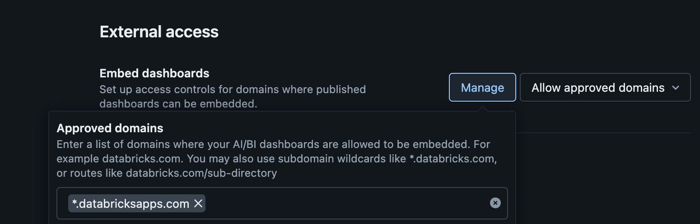
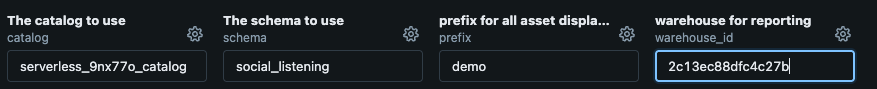
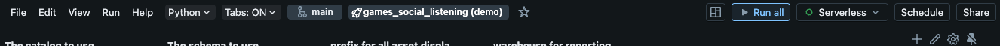

# Games Social Listening Demo

[](https://docs.databricks.com/en/data-governance/unity-catalog/index.html)
[](https://docs.databricks.com/en/compute/serverless.html)

**AI-powered player feedback analysis from Steam, Google Play, and Reddit using sentiment extraction and natural language insights.**

Maintainers: [Thomas Xu](thomas.xu@databricks.com), [Brendan Byam](brendan.byam@databricks.com)

## 🚀 What is Games Social Listening?

Games Social Listening is an end-to-end platform that transforms player feedback into actionable insights using AI. It:

- **Ingests** reviews and feedback from Steam, Google Play, and Reddit
- **Translates** content to English using AI translation
- **Analyzes** sentiment across 12 gameplay categories using AI
- **Generates** AI-powered reports tailored for different personas (Community Manager, Marketer, Game Designer)
- **Visualizes** insights through interactive dashboards and Genie Space natural language queries

## 📦 Installation

This solution uses [Databricks Asset Bundle](https://docs.databricks.com/en/dev-tools/bundles/index.html) with automated setup via the `Demo_Setup.ipynb` notebook:

### Prerequisites
- A [Databricks workspace](https://docs.databricks.com/aws/en/admin/workspace/) with [Unity Catalog enabled](https://docs.databricks.com/aws/en/data-governance/unity-catalog/enable-workspaces)
    - You must be a [Workspace Admin](https://docs.databricks.com/aws/en/admin/users-groups/users) to set up the demo (after setup, normal users can run and use it).
- Add `*.databricksapps.com` as a domain allowed to embed AI/BI Dashboards
    - Settings > Workspace Admin > Security > External Access:


- [Databricks CLI](https://docs.databricks.com/aws/en/dev-tools/cli/) installed (optional, for manual deployment)
- [Serverless compute](https://docs.databricks.com/aws/en/compute/serverless/) available
    - If you don't see Serverless as an option in the notebook, ensure you have these [Workspace Previews](https://docs.databricks.com/aws/en/admin/workspace-settings/manage-previews) enabled:
        - Serverless Compute for Delta Live Tables
        - Serverless Compute for Workflows and Notebooks
        - (You may see slightly different names, e.g. "Jobs" instead of "Workflows", "Declarative Pipelines" instead of "Delta Live Tables")
    - If you cannot use Serverless and must use classic compute, see the guidance in [`CONFIGURATION.md`](/docs/CONFIGURATION.md#using-classic-compute).

- [SQL Warehouse](https://docs.databricks.com/aws/en/compute/sql-warehouse/) for dashboard and app queries

### Demo Quick Start (Recommended)

1. **Clone the Repository to your Databricks workspace using a [Git Folder](https://docs.databricks.com/aws/en/repos/repos-setup)**
2. **(Optional)** - To enable Steam and Reddit ingestion, see the instructions in [docs/CONFIGURATION.md](docs/CONFIGURATION.md#enable-steam-and-reddit). **This requires API keys (free) for those platforms**.
3. Access the `Demo_Setup.ipynb` notebook and populate the widgets at the top with your desired values.


    - Create the catalog and schema if they do not already exist.
    - **Note:** The prefix can only contain lowercase letters, numbers, and hyphens, and that hyphens cannot be at the beginning or end.

4. **Select 'Run All'** to execute all cells in the notebook using serverless compute


    - The notebook will automatically:
        - Deploy all resources (Jobs, Pipeline, Dashboard, App) via a Databricks Asset Bundle
        - Configure with your workspace settings
        - Load sample data and execute sentiment analysis (Pokemon Go from Google Play)
    - Should take 10-15 minutes
    - Note: by default the Demo Setup notebook will ingest a small amount of data from Pokemon Go on the Google Play Store (to have some initial data to play with). If you want this initial ingestion to ingest data for a different game/platform instead, modify the `parameter` values at the bottom of `bundle/resources/Games Social Listening - Job.job.yml`, adding corresponding API keys via `Secrets Helper` if necessary.
5. **Access the deployed app** in your Databricks workspace!
    - Left sidebar > Compute > Apps

### Alternative: Configure DAB Deployment

For production or custom deployments, see [docs/CONFIGURATION.md#dab-deployment](docs/CONFIGURATION.md#dab-deployment) for CLI-based deployment.

Note that if you want to have multiple demo apps in the same Databricks workspace, make sure to update at least the bundle name in `databricks.yml` to prevent subsequent deploys from overwriting each other. If you still encounter errors, try deleting the `.databricks` directory (autogenerated by DAB validation/deployment) and retrying.

## 🏗️ Project Structure

```
cmeg_player_feedback_app/
├── databricks.yml                    # Databricks Asset Bundle configuration
├── Demo_Setup.ipynb                  # Automated installation notebook
├── bundle/
│   ├── resources/                        # DAB resource definitions
│   │   ├── Games Social Listening - Job.job.yml
│   │   ├── Games Social Listening - Pipeline.pipeline.yml
│   │   ├── Games Social Listening - Dashboard.dashboard.yml
│   │   └── Games Social Listening - App.app.yml
│   └── src/
│       ├── Abstracted_Ingestion.ipynb   # Multi-platform ingestion notebook
│       ├── Summary_Report_Generator.ipynb  # AI report generation
│       ├── app/                          # FastAPI web application
│       │   ├── main.py                   # App entry point
│       │   ├── config.yaml               # App configuration
│       │   ├── routers/                  # API endpoints
│       │   ├── utils/                    # Helper functions
│       │   └── templates/                # UI templates
│       ├── pipeline/                     # Spark Declarative Pipeline transformations
│       │   └── transformations/
│       │       ├── 01_ai_translation.py
│       │       ├── 02_ai_sentiment_extraction.py
│       │       ├── 03_parse_sentiment.py
│       │       └── 04_reporting_layer.py
│       ├── ingestion_utils/              # Platform-specific ingestors
│       │   ├── steam_ingestor.py
│       │   ├── google_play_ingestor.py
│       │   └── reddit_ingestor.py
│       └── config/                       # Configuration files
│           └── config.yaml               # Sentiment categories & personas
└── docs/                             # Documentation
    └── CONFIGURATION.md              # Customization & production guide
```

## 🔄 Demo Contents

The demo implements a **6-stage social listening analysis**:

### Stage 1: Ingestion
- **Pulls user generated content/feedback** from Steam, Google Play, or Reddit
- **Sampling**: Max 10K content records per source, sampled to 2K if exceeded

### Stage 2: AI Translation
- **Translates** all content to English using `ai_translate()`
- **Preserves** original text for reference

### Stage 3: Sentiment Extraction
- **Uses Meta Llama 3.3 70B** for AI sentiment analysis
- **Extracts sentiment** across categories and subtopics from user-generated content

### Stage 4: Reporting Layer Data
- **Creates gold tables** optimized for analytics
- **Powers** dashboard, app, and Genie Space

### Stage 5: Summary Report
- **Generates summary reports** of sentiment analysis for 3 personas (Community Manager, Marketer, Game Designer)

### Stage 6: Consolidates Insight and Actions in the App
- Add new games for sentiment analysis
- Review Summary Reports
- Ask natual language questions with genie
- Drill into deeper insights with the dashboard embedded into the app


## 🎯 Deployed Components

| Component | Description |
|-----------|-------------|
| **Spark Declarative Pipeline** | 4-stage transformation: translation → sentiment extraction → parsing → gold tables |
| **Orchestration Job** | Daily/New Game content ingestion + pipeline execution + dashboard refresh + generate summary report for new games |
| **AI/BI Dashboard** | Interactive analytics with filters, visualizations, and drill into sub topic sentiment |
| **Genie Space** | Natural language queries on player feedback data |
| **Summary Report Job** | Update the AI-generated summary reports for all tracked games |
| **Databricks App** | Add games and explore insights |

## ⚙️ Configuration and Customization

See [docs/CONFIGURATION.md](docs/CONFIGURATION.md) for:
- Customizing the demo for your own needs
- Productionalizing DAB and assets

## 📚 Documentation

>**Documentation Website**:  
https://databricks-industry-solutions.github.io/social-listening/

Documentation files in this repository:
- **[docs/CONFIGURATION.md](docs/CONFIGURATION.md)** - Customization, production deployment, and API keys setup
- **[src/app/README.md](src/app/README.md)** - Databricks App structure and configuration
- **[src/pipeline/README.md](src/pipeline/README.md)** - Pipeline development and transformations
- **[src/ingestion_utils/README.md](src/ingestion_utils/README.md)** - Details on ingestion from platforms, sampling, and adding new platforms for ingestion

## 🎮 Supported Platforms

| Platform | Content Type | Identifier Format | API Key Required |
|----------|--------------|-------------------|------------------|
| **Steam** | Game Reviews | Steam App ID (e.g., `730` for CS:GO) | Yes |
| **Google Play** | App Reviews | Package name (e.g., `com.nianticlabs.pokemongo`) | No |
| **Reddit** | Subreddit Posts | Subreddit name (e.g., `gaming`) | Yes |

To enable Steam and Reddit ingestion, see [CONFIGURATION.md](docs/CONFIGURATION.md#enable-steam-and-reddit).

You can also load data from your own bronze table in Unity Catalog, provided it is in the correct format. For more info see [CONFIGURATION.md](docs/CONFIGURATION.md#ingest-from-generic-table).

**Want to add a new platform?** The ingestion system uses an abstract `DataIngestor` class that makes it easy to add new sources (YouTube, TikTok, etc.). See [src/ingestion_utils/README.md](src/ingestion_utils/README.md) for a step-by-step guide. 

## Demo Teardown

To destroy all demo resources, uncomment the last few cells of the `Demo_Setup.ipynb` and run each to:
- Destroy resources managed by DAB
- Destroy Genie Space via API
- Destroy secret scope via SDK

## ⚠️ Disclaimer

Please note the code in this project is provided for your exploration only, and is not formally supported by Databricks with Service Level Agreements (SLAs). It is provided AS-IS and we do not make any guarantees of any kind. Please do not submit a support ticket relating to any issues arising from the use of this project.

## 📄 License

This project is licensed under the Databricks License. See [licenses.md](licenses.md) for more info.
