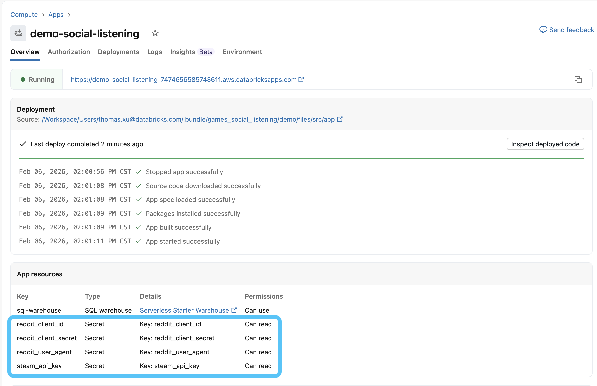

# Configuration & Long Term Use

This guide covers **customizing** the Games Social Listening demo and **productionalizing** it for daily use.

## Table of Contents

**Moving to Long Term Usage**
- [DAB Deployment](#dab-deployment)
- [Resource Naming and Prefixes](#resource-naming-and-prefixes)
- [Enable Job Scheduling](#enable-job-scheduling)
- [Remove Sampling (Optional)](#remove-sampling-optional)

**Customization**
- [Enable Steam and Reddit](#enable-steam-and-reddit)
- [Ingest from Generic Table](#ingest-from-generic-table)
- [Add New Platforms](#add-new-platforms)
- [LLM Endpoint Configuration](#llm-endpoint-configuration)
- [Sentiment Categories](#sentiment-categories)
- [Report Personas](#report-personas)
- [Genie Space](#genie-space)
- [Using Classic Compute](#using-classic-compute)

**App Configuration**
- [App Configuration and Customization](#app-configuration-and-customization)

---

## Moving to Long Term Usage

### DAB Deployment

For production, deploy Databricks Asset Bundles (DAB) via Databricks CLI instead of `Demo_Setup.ipynb`. The main bundle configuration file is `databricks.yml`.

Specifically, you'll need to hardcode bundle variables for each environment to deploy. Edit `databricks.yml` to hardcode values instead of passing via CLI:

```yaml
targets:
  prod:
    workspace:
      host: https://your-workspace.cloud.databricks.com
      root_path: /Workspace/Shared/.bundle/${bundle.name}/${bundle.target}
    variables:
      catalog: prod_social_listening        # Your production catalog
      schema: player_feedback                # Your production schema
      warehouse_id: abc123def456              # Your SQL Warehouse ID
      prefix: prod                            # Resource naming prefix
```

**Before**: Variables passed via `databricks bundle deploy --var="catalog=my_catalog"` in `Demo_Setup.ipynb`

**After**: Variables hardcoded in `databricks.yml`

#### Deployment Steps

```bash
# 1. Clone repository
git clone <repository-url>
cd social-listening

# 2. Validate bundle
databricks bundle validate --target prod

# 3. Deploy
databricks bundle deploy --target prod

# 4. Run job to populate data
databricks bundle run Games_Social_Listening_Job --target prod
```

#### Destroying Resources

```bash
# Remove all deployed resources
databricks bundle destroy --target prod
```

**Note**: Currently, not all configurations for the demo can be configured via DAB. Follow the `Demo_Setup.ipynb` to:
- Create the Genie Space via API
- Provide permissions to the App Service Principal to the catalog, job, and Genie Space
- Update the app configurations (`src/app/config.yaml`) with the deployed resources from DAB (Job ID, Genie Space ID, Dashboard URL, etc.)

### Resource Naming and Prefixes

You may notice deployed resources (job, pipeline, dashboard, etc.) are named with a `[dev john_smith]` style prefix, even when you set a custom `prefix` in `Demo_Setup.ipynb` (e.g. `my-prefix`). This is expected — there are **two different naming mechanisms** at play:

| Mechanism | Where it comes from | What it affects |
|-----------|---------------------|-----------------|
| The `prefix` **variable** | Set in `Demo_Setup.ipynb` / `databricks.yml` | Used inside resource definitions for names like the app name (`${var.prefix}_social_listening_app`) |
| The `[dev <username>]` **prefix** | Added automatically by DAB **development mode** | Prepended to jobs, pipelines, dashboards, etc. |

The `[dev <username>]` prefix is added by DAB's [development mode preset](https://docs.databricks.com/en/dev-tools/bundles/deployment-modes.html). When a target uses `mode: development`, DAB automatically prepends `[dev <short_name>]` to resource names (and also pauses schedules/triggers, sets concurrent run limits, etc.). This is by design, so multiple users can deploy the same bundle into one workspace without colliding.

So the `prefix` variable is applied where the resource definitions reference `${var.prefix}`. The `[dev ...]` is a separate, automatic development-mode behavior.

#### Option 1: Set a custom prefix in development mode

Override the `name_prefix` preset on the target in `bundle/databricks.yml`. This replaces the default `[dev <username>]`:

```yaml
targets:
  demo:
    mode: development
    default: true
    presets:
      name_prefix: "my-prefix_"     # replaces [dev <username>]; use "${var.prefix}_" to reuse your variable
    workspace:
      root_path: /Workspace/Users/${workspace.current_user.userName}/.bundle/${bundle.name}/${bundle.target}
```

To remove the prefix entirely (no `[dev ...]` and no custom string), set it to an empty string:

```yaml
    presets:
      name_prefix: ""
```

#### Option 2: Use production mode

Production mode (`mode: production`) drops the `[dev <username>]` prefix automatically and unpauses schedules. This is the recommended path for long-term/shared deployments. Resource names will then come solely from the resource definitions (including your `${var.prefix}` where referenced):

```yaml
targets:
  prod:
    mode: production
    workspace:
      host: https://your-workspace.cloud.databricks.com
      root_path: /Workspace/Shared/.bundle/${bundle.name}/${bundle.target}
    variables:
      catalog: prod_social_listening
      schema: player_feedback
      warehouse_id: abc123def456
      prefix: prod                  # used wherever resources reference ${var.prefix}
```

> **Note:** Production mode enforces stricter settings (e.g. unpaused schedules, run-as restrictions). If you only want cleaner names without the other production-mode changes, prefer the `presets.name_prefix` override in Option 1.

#### Important: redeploying does not rename existing resources

Changing the prefix and running `databricks bundle deploy` creates **new** resources under the new names. The old `[dev <username>]`-prefixed resources are only cleaned up if the bundle still tracks them in its deployment state, so you may end up with duplicates. The cleanest path is to **destroy the current deployment first**, then change the prefix and redeploy:

```bash
# From the bundle directory, using the same vars you deployed with
databricks bundle destroy --auto-approve
# ...change the prefix in databricks.yml, then:
databricks bundle deploy
```

### Enable Job Scheduling

To run data ingestion on a regular schedule or at specific times instead of being manually triggered via the app UI, you can follow these steps:

1. In Databricks, clone the job that was created by the bundle.
1. Modify the schedules/triggers as desired.
1. Add job parameters to match the ingestion schedule you want.
1. Read the job parameters in the task notebooks.

#### Steam Example
For example, for Steam you could add a job parameter called `steam_num_past_days`.
In `Abstracted Ingestion`, you could add this code snippet to read the widget value and then pass it as the `over_past_days` value of the SteamIngestor::ingest() call:
```python
dbutils.widgets.text("steam_over_past_days", "", "Steam Over Past Days")
steam_over_past_days = dbutils.widgets.get("steam_over_past_days")
if steam_over_past_days != "":
  # Note: can do a more rigorous check for float-conversion via try-except 
  steam_over_past_days = float(steam_over_past_days)
else:
  steam_over_past_days = None
```

Then, add the same snippet in `Summary_Report_Generator` as well as the following additional snippet to compute the `start_date` of the persona reports:
```python
    from datetime import datetime, timedelta
    if steam_over_past_days:
        start_date = datetime.now() - timedelta(days=steam_over_past_days)
        start_date = start_date.strftime("%Y-%m-%d")
```

Note that you should keep the default value of the widget empty if you don't want the app's original job from the bundle to be affected.

Additionally, note the app will always display the most recent report for each persona (regardless of which job triggered the Summary Report generation task).

### Remove Sampling (Optional)

By default, the demo limits ingestion to the equivalent of 2,000 reviews per game for performance and cost optimization. For production use cases requiring full data coverage, you may want to remove or adjust this sampling.

For more information on sampling strategy and configuration, see the [Ingestion Sampling Documentation](../bundle/src/ingestion_utils/README.md#sampling-strategy).

---

## Customization

Customize the demo for your use case, industry, and more.

### Enable Steam and Reddit

To enable ingestion from Steam and Reddit, you'll need to provide API keys to authenticate API calls. Under the hood, these will be stored securely as [Databricks Secrets](https://docs.databricks.com/aws/en/security/secrets/).

#### 0. Obtain Keys
- Steam:
  - Follow the instructions to obtain a free Web API key [here](https://steamcommunity.com/dev). You will need a [Steam account](https://store.steampowered.com/join).
- Reddit:
  - Sign up to create a free Developer account [here](https://developers.reddit.com/).
  - This will get you these required keys: `client_id`, `client_secret`, `user_agent`.
  - **Update**: Reddit began aggressively locking down access to their API late 2025, so this method no longer works.
    - If you already have the above keys from before, then they should continue to work and you can proceed. 
    - If you do not already have the above keys, the community consensus is that it is effectively impossible to attain them. Reach out to your Databricks team for support with alternative options.

#### 1. Add Your Keys
- Option 1: In-App Settings
  - Simply launch the app and provide your keys on the Settings > Credentials page.

- Option 2: [Databricks CLI](https://docs.databricks.com/aws/en/dev-tools/cli/)

  ```bash
  # Create Steam secret
  databricks secrets put-secret social_listening_app steam_api_key --string-value "YOUR_ACTUAL_STEAM_KEY"
  
  # Create Reddit secrets
  databricks secrets put-secret social_listening_app reddit_client_id --string-value "YOUR_ACTUAL_CLIENT_ID"
  databricks secrets put-secret social_listening_app reddit_client_secret --string-value "YOUR_ACTUAL_CLIENT_SECRET"
  databricks secrets put-secret social_listening_app reddit_user_agent --string-value "social_listening:v1.0 (by /u/yourusername)"

  # Verify Secrets Creation
  databricks secrets list-secrets social_listening_app
  ```

- Option 3: [Databricks Notebook](https://docs.databricks.com/aws/en/notebooks/)

  - Use the `Secrets_Helper.ipynb` notebook provided in this repository.

#### 2. Update Secrets in DAB Configuration

Uncomment the references to the secrets you added above in the App DAB resource (`resources/Games Social Listening - App.app.yml`). For secrets you didn't add values for, leave those lines commented:

```yaml
resources:
  apps:
    social_listening_app:
      name: ${var.prefix}_social_listening_app
      resources:
        - name: reddit_client_id
          secret:
            scope: social_listening_app
            key: reddit_client_id
        - name: reddit_client_secret
          secret:
            scope: social_listening_app
            key: reddit_client_secret
        - name: reddit_user_agent
          secret:
            scope: social_listening_app
            key: reddit_user_agent
        - name: steam_api_key
          secret:
            scope: social_listening_app
            key: steam_api_key
```

#### 3. Re-deploy the App
Simply re-run the `Demo_Setup.ipynb` notebook from top to bottom. When going to the app page in Databricks, you should see the newly added secrets under "App Resources":



### Ingest from Generic Table

You may ingest data from a generic table you've already created in Unity Catalog. 

1. Create your table
    - It can be located anywhere in Unity Catalog.
    - It can include multiple `game_name` values and `content_type` values (see below). 
    - It must include the following columns:
      - `content_id`
        - Type: string
        - E.g. "123", "abc-def", etc.  
      - `content_type`
        - Type: string
        - E.g. "Steam Review", "Reddit Comment"  
      - `game_name`
        - Type: string
        - E.g. "Call of Duty"
      - `content_text`
        - Type: string
        - E.g. a game review, social media comment, etc.
      - `timestamp`
        - Type: timestamp
        - E.g. 2026-02-02T20:34:55.126+00:00
      - `author_id`
        - Type: string
        - E.g. "abc-123", "john_smith_98"
      - `content_metadata`
        - Type: string
        - Can be empty, a JSON string, or any other value you would like. This column is unused in the pipeline, and is used as a catch-all for relevant metadata associated with each piece of content.
        - E.g. "{"upvotes": 123, "tags": ["action", "adventure"]}"

1. Change the App configuration file
    - Starting from the root of this repo, navigate to `src/app/config.yaml`.
    - Add `generic_table` to the `ui/main/add_game_sources` section.

1. Re-run the `Demo_Setup` notebook.

1. Re-open the App, and you should now see the "Generic Table" option on the "Add Game" page.
    - Follow the on-screen instructions to add your bronze table.
    - Your bronze table will remain unchanged, and rows will be added to the auto-generated bronze/silver/gold tables from the Lakeflow Job and Pipeline.
    - You may append to the same bronze table and re-add it multiple times (there is built-in de-duplication).


### Add New Platforms

Existing supported platforms:

| Platform | Content Type | Identifier Format | API Key Required |
|----------|--------------|-------------------|------------------|
| **Steam** | Game Reviews | Steam App ID (e.g., `730` for CS:GO) | Yes |
| **Google Play** | App Reviews | Package name (e.g., `com.nianticlabs.pokemongo`) | No |
| **Reddit** | Subreddit Posts | Subreddit name (e.g., `gaming`) | Yes |

**Want to add a new platform?** The ingestion system uses an abstract `DataIngestor` class that makes it easy to add new sources (YouTube, TikTok, etc.). See [src/ingestion_utils/README.md](../src/ingestion_utils/README.md) for a step-by-step guide.

### LLM Endpoint Configuration

The solution uses Databricks Foundation Model APIs for AI-powered sentiment extraction and report generation. You can customize the LLM endpoint and parameters in `bundle/src/config/config.yaml`.

#### Default Configuration

```yaml
llm:
  endpoint_name: "databricks-meta-llama-3-3-70b-instruct"
  parameters:
    max_tokens: 1000
    temperature: 0.20
```

#### Customizing the LLM

**Endpoint Name**: Change to any Databricks Foundation Model endpoint or your own provisioned model.

**Parameters**:
- `max_tokens`: Maximum number of tokens in the response (default: 1000)
- `temperature`: Controls randomness in responses (0.0 = deterministic, 1.0 = creative, default: 0.20)

#### Example: Using a Different Model

```yaml
llm:
  endpoint_name: "databricks-meta-llama-3-1-405b-instruct"
  parameters:
    max_tokens: 1500
    temperature: 0.15
```

**Note**: After changing the LLM configuration, restart the pipeline jobs and app to apply the changes.

### Sentiment Categories

Sentiment categories define the topics extracted from the content.

#### Default Categories

Defined in `bundle/src/config/config.yaml`:

```yaml
sentiment_categories:
  - 'gameplay_mechanics'           # Core gameplay features
  - 'matchmaking_game_balance'     # Fairness, matchmaking
  - 'game_performance'             # FPS, lag, crashes
  - 'replayability'                # Long-term engagement
  - 'character'                    # Character design, abilities
  - 'monetization'                 # IAP, pricing, pay-to-win
  - 'bugs_glitches_techissues'     # Technical issues
  - 'graphics_audio'               # Visuals and sound
  - 'suggestion_feedback'          # Feature requests
  - 'account_issues'               # Login, account problems
  - 'cheating_hacking'             # Cheating, exploits
  - 'toxicity'                     # Community toxicity
  - 'player_retention'             # Retention, churn
  - 'onboarding'                   # New player experience
```

#### Customizing Categories

Edit `bundle/src/config/config.yaml` to add, remove, or modify categories based on your specific needs.

You should also [update the Genie Space](#genie-space) accordingly afterwards.

Note that if you want to change the categories in the future after already ingesting some data, the Declarative Pipeline will require a full refresh. (Ingested data in the `bronze` table would not need to change. Changing personas or persona prompts only affects the Summary Report generation, so the Declarative Pipeline is unaffected.)

### Report Personas

AI-generated reports are customized for different personas/stakeholders.

#### Default Personas

Defined in `bundle/src/config/config.yaml`:

```yaml
personas:
  community_manager:
    display_text: 'Community Manager'
    prompt: 'You are an expert community manager assistant...'

  marketer:
    display_text: 'Marketer'
    prompt: 'Write a concise, human-readable summary for a marketer...'

  game_designer:
    display_text: 'Game Designer'
    prompt: 'Write a concise, human-readable summary for a game designer...'
```

#### Customizing Personas

Add or modify personas in `bundle/src/config/config.yaml` to match your organization's roles. Each persona should include:
- `display_text`: The human-readable name shown in the UI
- `prompt`: The system prompt that defines how the AI generates reports for this persona

You will also need to add matching display names in `bundle/src/app/config.yaml`.

### Genie Space

If you modified the sentiment categories or want to make other updates to the Genie space, you can update the Genie Space instructions by following these steps:

If Genie Space already created:
1. Navigate to your Genie Space in Databricks (e.g. via bottom-left link in the deployed app)
2. Click **Edit** → **General Instructions**
3. Ensure the sentiment category list matches your `config.yaml`

If Genie Space not yet created:
1. Update the contents of `bundle/src/genie_space/genie_instructions.txt`
2. Re-run `Demo_Setup.ipynb`

### Using Classic Compute

This demo is meant to use Serverless compute, and Serverless compute is also recommended for its ease of use, autoscaling, etc. If you must use classic compute, you will need to edit the resource YAML definitions as described below.

The `Demo_Setup.ipynb` notebook itself can run on either Serverless or a classic all-purpose cluster with no changes — it is pure orchestration (CLI, SDK, and `spark.sql` calls). Only the **deployed** pipeline and jobs are pinned to Serverless, so those are what you change here.

> **Important — AI functions are the main risk, not the cluster wiring.** The pipeline uses `ai_translate` and `ai_query` (against a Foundation Model endpoint). These require a recent Databricks Runtime with **Photon** enabled. Use a recent LTS runtime (15.4 LTS or later) and `data_security_mode: SINGLE_USER` so the pipeline/jobs can access Unity Catalog and the model serving endpoint. On Serverless these worked automatically; on classic compute you are responsible for choosing a runtime that supports them.
>
> **Note on cloud-specific values.** The `node_type_id` values below are AWS examples (`m5d.large`). Swap them for your cloud — Azure: `Standard_DS3_v2`, GCP: `n2-standard-4`. Consider promoting `node_type_id` and `spark_version` to bundle variables in `databricks.yml` so they aren't hardcoded across multiple files.

#### 1. Pipeline (`bundle/resources/Games Social Listening - Pipeline.pipeline.yml`)

Remove `serverless: true` and add a classic `clusters` block. A pipeline always runs on its own compute (it is a Lakeflow Declarative Pipeline, not the all-purpose cluster), so "classic" here means giving it a classic cluster spec:

```yaml
resources:
  pipelines:
    games_social_listening_pipeline:
      name: Games Social Listening Pipeline
      libraries:
        - glob:
            include: ../src/pipeline/transformations/**
      catalog: ${var.catalog}
      schema: ${var.schema}
      root_path: ../src/pipeline/
      # serverless: true        <-- REMOVE this line
      channel: CURRENT          # keep CURRENT so ai_translate/ai_query are available
      photon: true              # recommended for AI functions + performance
      edition: ADVANCED
      clusters:
        - label: default
          node_type_id: m5d.large          # AWS example — swap per cloud
          driver_node_type_id: m5d.large
          autoscale:
            min_workers: 1
            max_workers: 3
            mode: ENHANCED
```

Note: pipelines take **no `spark_version`** — the runtime is controlled by `channel`. Keep it set to `CURRENT`.

#### 2. Main Job (`bundle/resources/Games Social Listening - Job.job.yml`)

The two `notebook_task`s (`pull_source_content` and `summary_report_gen`) currently have no compute defined, so they default to Serverless. Add a shared classic `job_clusters` block and attach it to each notebook task via `job_cluster_key`.

Leave the other tasks unchanged:
- `pipeline_task` (`sentiment-extraction`) uses the pipeline's own compute (configured above)
- `condition_task` (`new_game_check`) needs no compute
- `dashboard_task` (`refresh_dashboard`) uses the SQL warehouse (`warehouse_id`)

```yaml
resources:
  jobs:
    games_social_listening_job:
      name: Games Social Listening Job
      job_clusters:                          # <-- ADD this block
        - job_cluster_key: shared_classic
          new_cluster:
            spark_version: 15.4.x-scala2.12  # recent LTS; required for ai_query support
            node_type_id: m5d.large          # swap per cloud
            data_security_mode: SINGLE_USER  # needed for Unity Catalog + model serving access
            autoscale:
              min_workers: 1
              max_workers: 2
      tasks:
        - task_key: pull_source_content
          job_cluster_key: shared_classic    # <-- ADD to this notebook_task
          notebook_task:
            ...
        # sentiment-extraction (pipeline_task)  -> unchanged
        # new_game_check (condition_task)        -> unchanged
        - task_key: summary_report_gen
          job_cluster_key: shared_classic    # <-- ADD to this notebook_task
          notebook_task:
            ...
        # refresh_dashboard (dashboard_task)     -> unchanged (uses warehouse_id)
```

Only the two `notebook_task` entries get a `job_cluster_key`.

#### 3. Summary Report Job (`bundle/resources/Games Social Listening - Weekly Summary Report Job.job.yml`)

This job's single `report_generator` notebook task also defaults to Serverless. Apply the same pattern:

```yaml
resources:
  jobs:
    games_social_listening_weekly_summary_report:
      name: Games Social Listening - Weekly Summary Report
      job_clusters:                          # <-- ADD this block
        - job_cluster_key: shared_classic
          new_cluster:
            spark_version: 15.4.x-scala2.12
            node_type_id: m5d.large
            data_security_mode: SINGLE_USER
            num_workers: 1
      tasks:
        - task_key: report_generator
          job_cluster_key: shared_classic    # <-- ADD
          notebook_task:
            ...
```

#### What stays on managed/Serverless compute regardless

These cannot be moved to classic compute:
- The **dashboard refresh** and **Genie Space** still require the SQL warehouse (`warehouse_id`) — unchanged.
- The **Databricks App** runs on its own managed app infrastructure — there is no classic option for it.

#### Cheaper alternative for demos

Instead of provisioning a `new_cluster`, you can point the notebook tasks at an existing all-purpose cluster with `existing_cluster_id: <cluster-id>` (or a bundle variable) in place of `job_cluster_key`. This is fine for a demo but not recommended for production. The pipeline still needs its own `clusters` block either way.

---

## App Configuration and Customization

Please see the [bundle/src/app/README.md](../bundle/src/app/README.md) for detailed configuration and customization options for the application.

---

## Additional Resources

- [Databricks Asset Bundles Documentation](https://docs.databricks.com/en/dev-tools/bundles/index.html)
- [Databricks CLI Reference](https://docs.databricks.com/en/dev-tools/cli/index.html)
- [Unity Catalog](https://docs.databricks.com/en/data-governance/unity-catalog/index.html)
- [Spark Declarative Pipelines](https://docs.databricks.com/en/delta-live-tables/index.html)
- [Databricks Apps](https://docs.databricks.com/en/dev-tools/databricks-apps/index.html)

